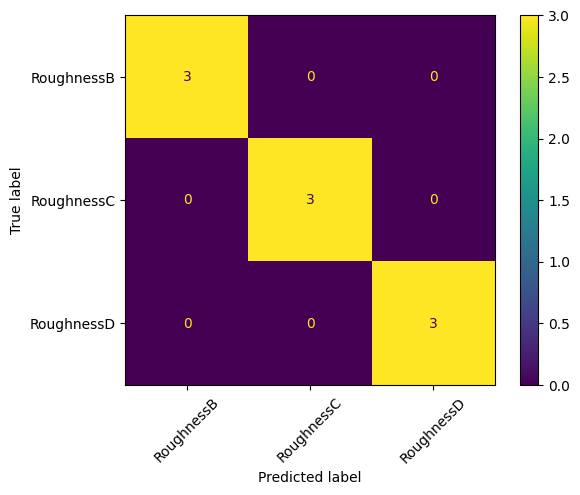

## Data Set Creation

Classes: 

<br>
Class 0: Surface Roughness B
<br>
Class 1: Surface Roughness C
<br>
Class 2: Surface Roughness D


```python
from huggingface_hub import notebook_login

notebook_login()
```


```python
from datasets import load_dataset
```


```python
# # Uncomment to load dataset from local file using "imagefolder"
# dataset = load_dataset("imagefolder", data_dir = "./data")
```


    Resolving data files:   0%|          | 0/66 [00:00<?, ?it/s]


    Downloading and preparing dataset imagefolder/default to /home/szheng/.cache/huggingface/datasets/imagefolder/default-7ffa335bd6be5224/0.0.0/37fbb85cc714a338bea574ac6c7d0b5be5aff46c1862c1989b20e0771199e93f...


    Downloading data files:   0%|          | 0/66 [00:00<?, ?it/s]


    Downloading data files: 0it [00:00, ?it/s]


    Extracting data files: 0it [00:00, ?it/s]


    Downloading data files:   0%|          | 0/9 [00:00<?, ?it/s]


    Downloading data files: 0it [00:00, ?it/s]


    Extracting data files: 0it [00:00, ?it/s]


    Downloading data files:   0%|          | 0/15 [00:00<?, ?it/s]


    Downloading data files: 0it [00:00, ?it/s]


    Extracting data files: 0it [00:00, ?it/s]


    Generating train split: 0 examples [00:00, ? examples/s]


    Generating validation split: 0 examples [00:00, ? examples/s]


    Generating test split: 0 examples [00:00, ? examples/s]


    Dataset imagefolder downloaded and prepared to /home/szheng/.cache/huggingface/datasets/imagefolder/default-7ffa335bd6be5224/0.0.0/37fbb85cc714a338bea574ac6c7d0b5be5aff46c1862c1989b20e0771199e93f. Subsequent calls will reuse this data.


      0%|          | 0/3 [00:00<?, ?it/s]


```python
# # check dataset
# dataset
```


    DatasetDict({
        train: Dataset({
            features: ['image', 'label'],
            num_rows: 66
        })
        validation: Dataset({
            features: ['image', 'label'],
            num_rows: 9
        })
        test: Dataset({
            features: ['image', 'label'],
            num_rows: 15
        })
    })


```python
# Uncommentt to push to hub#
dataset.push_to_hub("sh-zheng/SurfaceRoughness")
```

    Pushing split train to the Hub.


    Map:   0%|          | 0/66 [00:00<?, ? examples/s]


    Pushing dataset shards to the dataset hub:   0%|          | 0/1 [00:00<?, ?it/s]


    Creating parquet from Arrow format:   0%|          | 0/1 [00:00<?, ?ba/s]


    Pushing split validation to the Hub.


    Map:   0%|          | 0/9 [00:00<?, ? examples/s]


    Pushing dataset shards to the dataset hub:   0%|          | 0/1 [00:00<?, ?it/s]


    Creating parquet from Arrow format:   0%|          | 0/1 [00:00<?, ?ba/s]


    Pushing split test to the Hub.


    Map:   0%|          | 0/15 [00:00<?, ? examples/s]


    Pushing dataset shards to the dataset hub:   0%|          | 0/1 [00:00<?, ?it/s]


    Creating parquet from Arrow format:   0%|          | 0/1 [00:00<?, ?ba/s]


```python
# Load dataset from hub
dataset = load_dataset('sh-zheng/SurfaceRoughness',split='train')
```


```python
dataset
```


    DatasetDict({
        train: Dataset({
            features: ['image', 'label'],
            num_rows: 66
        })
        validation: Dataset({
            features: ['image', 'label'],
            num_rows: 9
        })
        test: Dataset({
            features: ['image', 'label'],
            num_rows: 15
        })
    })


```python
## examples of splitting training data to test and train 
# split_dataset = dataset.train_test_split(test_size=0.15)
# test_ds = split_dataset['test']
# train_ds = split_dataset['train']
# test_ds
```


```python
train_ds = dataset['train']
test_ds = dataset['test']
```


```python
test_ds['label']
```


    [0, 0, 0, 0, 0, 1, 1, 1, 1, 1, 2, 2, 2, 2, 2]


```python
## show all test images 
# from IPython.display import display

# for sample in test_ds:
#     display(sample['image'])
```


```python
id2label = {id:label for id, label in enumerate(train_ds.features['label'].names)}
label2id = {label:id for id,label in id2label.items()}
id2label
```


    {0: 'RoughnessB', 1: 'RoughnessC', 2: 'RoughnessD'}


```python
id2label[train_ds[0]['label']]
```


    'RoughnessB'


## Data Preparation


```python
from transformers import ViTImageProcessor

processor = ViTImageProcessor.from_pretrained("google/vit-base-patch16-224-in21k")
image_mean = processor.image_mean
image_std = processor.image_std
size = processor.size["height"]
```

    2023-11-28 20:33:51.374878: W tensorflow/compiler/tf2tensorrt/utils/py_utils.cc:38] TF-TRT Warning: Could not find TensorRT


```python
from torchvision.transforms import (CenterCrop, 
                                    Compose, 
                                    Normalize, 
                                    RandomHorizontalFlip,
                                    RandomResizedCrop, 
                                    Resize, 
                                    ToTensor)

normalize = Normalize(mean=image_mean, std=image_std)
_train_transforms = Compose(
        [
            RandomResizedCrop(size),
            RandomHorizontalFlip(),
            ToTensor(),
            normalize,
        ]
    )

_val_transforms = Compose(
        [
            Resize(size),
            CenterCrop(size),
            ToTensor(),
            normalize,
        ]
    )

def train_transforms(examples):
    examples['pixel_values'] = [_train_transforms(image.convert("RGB")) for image in examples['image']]
    return examples

def val_transforms(examples):
    examples['pixel_values'] = [_val_transforms(image.convert("RGB")) for image in examples['image']]
    return examples
```


```python
# Set the transforms
train_ds.set_transform(train_transforms)
test_ds.set_transform(val_transforms)
```


```python
train_ds[:2]
```


    {'image': [<PIL.PngImagePlugin.PngImageFile image mode=RGBA size=1041x639>,
      <PIL.PngImagePlugin.PngImageFile image mode=RGBA size=784x520>],
     'label': [0, 0],
     'pixel_values': [tensor([[[ 0.2314,  0.2235,  0.2078,  ..., -0.0353,  0.0588,  0.1137],
               [ 0.0275, -0.0275, -0.2157,  ..., -0.2392, -0.2157, -0.2000],
               [ 0.0431, -0.0667, -0.4118,  ..., -0.0039,  0.0039,  0.0039],
               ...,
               [-0.4118, -0.0353, -0.1765,  ...,  0.2078, -0.0118,  0.1686],
               [-0.2157,  0.0431, -0.2314,  ...,  0.3255,  0.0980,  0.0667],
               [ 0.0039,  0.1765,  0.0039,  ...,  0.0745, -0.0196, -0.0431]],
      
              [[ 0.2157,  0.2157,  0.2000,  ..., -0.0118,  0.0824,  0.1216],
               [ 0.0039, -0.0353, -0.2157,  ..., -0.2392, -0.2157, -0.2000],
               [ 0.0118, -0.0824, -0.4196,  ..., -0.0039,  0.0039,  0.0039],
               ...,
               [-0.4039, -0.0353, -0.1765,  ...,  0.1608, -0.0667,  0.1137],
               [-0.2157,  0.0431, -0.2314,  ...,  0.3020,  0.0745,  0.0353],
               [ 0.0039,  0.1765,  0.0039,  ...,  0.0588, -0.0353, -0.0588]],
      
              [[ 0.1373,  0.1451,  0.1373,  ..., -0.1294, -0.0353, -0.0039],
               [-0.2157, -0.2392, -0.3725,  ..., -0.2784, -0.2549, -0.2471],
               [-0.2627, -0.3255, -0.5922,  ..., -0.0118, -0.0118, -0.0039],
               ...,
               [-0.4118, -0.0275, -0.1686,  ...,  0.0745, -0.1529,  0.0275],
               [-0.2157,  0.0431, -0.2314,  ...,  0.1922, -0.0353, -0.0667],
               [ 0.0039,  0.1765,  0.0039,  ..., -0.0588, -0.1529, -0.1686]]]),
      tensor([[[-0.2941, -0.2471,  0.0196,  ...,  0.0039, -0.0275, -0.0824],
               [-0.2471, -0.0902,  0.2392,  ...,  0.0667,  0.0510, -0.0824],
               [-0.1608,  0.1059,  0.2863,  ...,  0.1922,  0.1216, -0.0824],
               ...,
               [ 0.0039,  0.1529,  0.4118,  ...,  0.1608,  0.0745,  0.1843],
               [-0.0745,  0.0510,  0.2706,  ...,  0.1294,  0.1059,  0.3412],
               [ 0.1843,  0.1765,  0.1608,  ..., -0.1059,  0.1451,  0.2314]],
      
              [[-0.2235, -0.1922,  0.0667,  ..., -0.0196, -0.0275, -0.0824],
               [-0.1843, -0.0431,  0.2784,  ...,  0.0588,  0.0588, -0.0824],
               [-0.1137,  0.1451,  0.3098,  ...,  0.2000,  0.1373, -0.0745],
               ...,
               [ 0.0039,  0.1608,  0.4118,  ...,  0.0588, -0.0510,  0.0588],
               [-0.0824,  0.0431,  0.2549,  ...,  0.0510,  0.0196,  0.2549],
               [ 0.1451,  0.1373,  0.1216,  ..., -0.1451,  0.1137,  0.2000]],
      
              [[-0.4275, -0.3804, -0.1137,  ..., -0.0745, -0.0824, -0.0980],
               [-0.3804, -0.2314,  0.0980,  ...,  0.0039,  0.0039, -0.0902],
               [-0.2941, -0.0353,  0.1373,  ...,  0.1373,  0.0824, -0.0902],
               ...,
               [-0.2392, -0.0824,  0.1922,  ..., -0.0824, -0.1922, -0.0824],
               [-0.3020, -0.1765,  0.0510,  ..., -0.0745, -0.1059,  0.1294],
               [-0.0275, -0.0431, -0.0431,  ..., -0.2549,  0.0118,  0.1059]]])]}


```python
from torch.utils.data import DataLoader
import torch

def collate_fn(examples):
    pixel_values = torch.stack([example["pixel_values"] for example in examples])
    labels = torch.tensor([example["label"] for example in examples])
    return {"pixel_values": pixel_values, "labels": labels}

train_dataloader = DataLoader(train_ds, collate_fn=collate_fn, batch_size=2)
```


```python
batch = next(iter(train_dataloader))
for k,v in batch.items():
    if isinstance(v, torch.Tensor):
        print(k, v.shape)
```

    pixel_values torch.Size([2, 3, 224, 224])
    labels torch.Size([2])


## Define the Model


```python
from transformers import ViTForImageClassification

model = ViTForImageClassification.from_pretrained('google/vit-base-patch16-224-in21k',
                                                  id2label=id2label,
                                                  label2id=label2id)
```

    Some weights of the model checkpoint at google/vit-base-patch16-224-in21k were not used when initializing ViTForImageClassification: ['pooler.dense.bias', 'pooler.dense.weight']
    - This IS expected if you are initializing ViTForImageClassification from the checkpoint of a model trained on another task or with another architecture (e.g. initializing a BertForSequenceClassification model from a BertForPreTraining model).
    - This IS NOT expected if you are initializing ViTForImageClassification from the checkpoint of a model that you expect to be exactly identical (initializing a BertForSequenceClassification model from a BertForSequenceClassification model).
    Some weights of ViTForImageClassification were not initialized from the model checkpoint at google/vit-base-patch16-224-in21k and are newly initialized: ['classifier.weight', 'classifier.bias']
    You should probably TRAIN this model on a down-stream task to be able to use it for predictions and inference.


```python
print(model.parameters)
```

    <bound method Module.parameters of ViTForImageClassification(
      (vit): ViTModel(
        (embeddings): ViTEmbeddings(
          (patch_embeddings): ViTPatchEmbeddings(
            (projection): Conv2d(3, 768, kernel_size=(16, 16), stride=(16, 16))
          )
          (dropout): Dropout(p=0.0, inplace=False)
        )
        (encoder): ViTEncoder(
          (layer): ModuleList(
            (0-11): 12 x ViTLayer(
              (attention): ViTAttention(
                (attention): ViTSelfAttention(
                  (query): Linear(in_features=768, out_features=768, bias=True)
                  (key): Linear(in_features=768, out_features=768, bias=True)
                  (value): Linear(in_features=768, out_features=768, bias=True)
                  (dropout): Dropout(p=0.0, inplace=False)
                )
                (output): ViTSelfOutput(
                  (dense): Linear(in_features=768, out_features=768, bias=True)
                  (dropout): Dropout(p=0.0, inplace=False)
                )
              )
              (intermediate): ViTIntermediate(
                (dense): Linear(in_features=768, out_features=3072, bias=True)
                (intermediate_act_fn): GELUActivation()
              )
              (output): ViTOutput(
                (dense): Linear(in_features=3072, out_features=768, bias=True)
                (dropout): Dropout(p=0.0, inplace=False)
              )
              (layernorm_before): LayerNorm((768,), eps=1e-12, elementwise_affine=True)
              (layernorm_after): LayerNorm((768,), eps=1e-12, elementwise_affine=True)
            )
          )
        )
        (layernorm): LayerNorm((768,), eps=1e-12, elementwise_affine=True)
      )
      (classifier): Linear(in_features=768, out_features=3, bias=True)
    )>


```python
num_trainable_params = sum(p.numel() for p in model.parameters())

print("Number of trainable parameters:", num_trainable_params)
```

    Number of trainable parameters: 85800963


```python
from transformers import TrainingArguments, Trainer

metric_name = "accuracy"

args = TrainingArguments(
    f"vit-base-patch16-224-in21k-fintuned-SurfaceRoughness",
    overwrite_output_dir=True,
    save_strategy="epoch",
    evaluation_strategy="epoch",
    learning_rate=2e-5,
    per_device_train_batch_size=3,
    per_device_eval_batch_size=2,
    num_train_epochs=6,
    weight_decay=0.01,
    load_best_model_at_end=True,
    metric_for_best_model=metric_name,
    logging_dir='logs',
    remove_unused_columns=False,
#     push_to_hub=True,
)
```


```python
from sklearn.metrics import accuracy_score
import numpy as np

def compute_metrics(eval_pred):
    predictions, labels = eval_pred
    predictions = np.argmax(predictions, axis=1)
    return dict(accuracy=accuracy_score(predictions, labels))
```


```python
import torch

trainer = Trainer(
    model,
    args,
    train_dataset=train_ds,
    eval_dataset=test_ds,
    data_collator=collate_fn,
    compute_metrics=compute_metrics,
    tokenizer=processor,
)
```

## Train model


```python
# Start tensorboard.
%load_ext tensorboard

# Clear any logs from previous runs
%rm -rf ./logs/
```

    /bin/bash: /home/szheng/miniconda3/envs/tf/lib/libtinfo.so.6: no version information available (required by /bin/bash)


```python
trainer_results = trainer.train()
```

    /home/szheng/miniconda3/envs/tf/lib/python3.9/site-packages/transformers/optimization.py:391: FutureWarning: This implementation of AdamW is deprecated and will be removed in a future version. Use the PyTorch implementation torch.optim.AdamW instead, or set `no_deprecation_warning=True` to disable this warning
      warnings.warn(


    <div>

      <progress value='132' max='132' style='width:300px; height:20px; vertical-align: middle;'></progress>
      [132/132 00:24, Epoch 6/6]
    </div>
    <table border="1" class="dataframe">
  <thead>
 <tr style="text-align: left;">
      <th>Epoch</th>
      <th>Training Loss</th>
      <th>Validation Loss</th>
      <th>Accuracy</th>
    </tr>
  </thead>
  <tbody>
    <tr>
      <td>1</td>
      <td>No log</td>
      <td>1.011446</td>
      <td>0.533333</td>
    </tr>
    <tr>
      <td>2</td>
      <td>No log</td>
      <td>0.941577</td>
      <td>0.800000</td>
    </tr>
    <tr>
      <td>3</td>
      <td>No log</td>
      <td>0.877163</td>
      <td>0.800000</td>
    </tr>
    <tr>
      <td>4</td>
      <td>No log</td>
      <td>0.842332</td>
      <td>0.733333</td>
    </tr>
    <tr>
      <td>5</td>
      <td>No log</td>
      <td>0.803827</td>
      <td>0.800000</td>
    </tr>
    <tr>
      <td>6</td>
      <td>No log</td>
      <td>0.792002</td>
      <td>0.800000</td>
    </tr>
  </tbody>
</table><p>


```python
# rest is optional but nice to have
trainer.save_model()
trainer.log_metrics("train", trainer_results.metrics)
trainer.save_metrics("train", trainer_results.metrics)
trainer.save_state()
```

    ***** train metrics *****
      epoch                    =        6.0
      total_flos               = 28579591GF
      train_loss               =     0.7547
      train_runtime            = 0:00:31.12
      train_samples_per_second =     12.721
      train_steps_per_second   =       4.24


```python
%tensorboard --logdir logs/
```


<iframe id="tensorboard-frame-1c80317fa3b1799d" width="100%" height="800" frameborder="0">
</iframe>
<script>
  (function() {
    const frame = document.getElementById("tensorboard-frame-1c80317fa3b1799d");
    const url = new URL("/", window.location);
    const port = 6006;
    if (port) {
      url.port = port;
    }
    frame.src = url;
  })();
</script>


```python
eval_ds = load_dataset('sh-zheng/SurfaceRoughness',split='validation')
```

    Found cached dataset parquet (/home/szheng/.cache/huggingface/datasets/sh-zheng___parquet/sh-zheng--SurfaceRoughness-93edba021c163672/0.0.0/14a00e99c0d15a23649d0db8944380ac81082d4b021f398733dd84f3a6c569a7)


```python
eval_ds.set_transform(val_transforms)
```


```python
outputs = trainer.predict(eval_ds)
```


```python
print(outputs.metrics)
```

    {'test_loss': 0.8057113885879517, 'test_accuracy': 1.0, 'test_runtime': 0.6192, 'test_samples_per_second': 14.534, 'test_steps_per_second': 4.845}


```python
from sklearn.metrics import confusion_matrix, ConfusionMatrixDisplay

y_true = outputs.label_ids
y_pred = outputs.predictions.argmax(1)

labels = train_ds.features['label'].names
cm = confusion_matrix(y_true, y_pred)
disp = ConfusionMatrixDisplay(confusion_matrix=cm, display_labels=labels)
disp.plot(xticks_rotation=45)
```


    <sklearn.metrics._plot.confusion_matrix.ConfusionMatrixDisplay at 0x7f5d116a0ca0>


    

    


```python
metrics = trainer.evaluate()
# some nice to haves:
trainer.log_metrics("eval", metrics)
trainer.save_metrics("eval", metrics)
```


<div>

  <progress value='5' max='5' style='width:300px; height:20px; vertical-align: middle;'></progress>
  [5/5 00:00]
</div>


    ***** eval metrics *****
      epoch                   =        6.0
      eval_accuracy           =        0.8
      eval_loss               =     0.9416
      eval_runtime            = 0:00:00.89
      eval_samples_per_second =      16.76
      eval_steps_per_second   =      5.587


```python
outputs
```


    PredictionOutput(predictions=array([[ 0.2329774 ,  0.03155657, -0.45679575],
           [ 0.18169105, -0.18114871, -0.450362  ],
           [ 0.33226871, -0.17552526, -0.5317114 ],
           [-0.25831756,  0.4167516 , -0.36084345],
           [-0.09132009,  0.3594358 , -0.24470577],
           [-0.21717554,  0.3062056 , -0.25359327],
           [-0.21909918, -0.12892163,  0.20089278],
           [-0.15033586, -0.20968178,  0.14408022],
           [-0.15804693, -0.03367691,  0.19738777]], dtype=float32), label_ids=array([0, 0, 0, 1, 1, 1, 2, 2, 2]), metrics={'test_loss': 0.8057113885879517, 'test_accuracy': 1.0, 'test_runtime': 0.6192, 'test_samples_per_second': 14.534, 'test_steps_per_second': 4.845})


```python
# push fine-tuned model to repository for inference
trainer.model.push_to_hub('sh-zheng/vit-base-patch16-224-in21k-fintuned-SurfaceRoughness')
```


    pytorch_model.bin:   0%|          | 0.00/343M [00:00<?, ?B/s]


    CommitInfo(commit_url='https://huggingface.co/sh-zheng/vit-base-patch16-224-in21k-fintuned-SurfaceRoughness/commit/5a453f18d3c6c72ce08a0870302725cb9d72fe42', commit_message='Upload ViTForImageClassification', commit_description='', oid='5a453f18d3c6c72ce08a0870302725cb9d72fe42', pr_url=None, pr_revision=None, pr_num=None)


## Using Fine-Tuned Models 


```python
from PIL import Image
from transformers import AutoModelForImageClassification, AutoImageProcessor

repo_name = "sh-zheng/vit-base-patch16-224-in21k-fintuned-SurfaceRoughness"

image_processor = AutoImageProcessor.from_pretrained(repo_name)
model = AutoModelForImageClassification.from_pretrained(repo_name)
```


    Downloading pytorch_model.bin:   0%|          | 0.00/343M [00:00<?, ?B/s]


```python
eval_data_path = "./data/validation/RoughnessD/0003.png"
eval_image = Image.open(eval_data_path).convert("RGB")
```


```python
eval_image
```


    

    


```python
# prepare image for the model
encoding = image_processor(eval_image.convert("RGB"), return_tensors="pt")
print(encoding.pixel_values.shape)
```

    torch.Size([1, 3, 224, 224])


```python
import torch

# forward pass
with torch.no_grad():
    outputs = model(**encoding)
    logits = outputs.logits
```


```python
predicted_class_idx = logits.argmax(-1).item()
print("Predicted class:", model.config.id2label[predicted_class_idx])
```

    Predicted class: RoughnessD


```python
# Using the Pipeline method
from transformers import pipeline

pipe = pipeline("image-classification", "sh-zheng/vit-base-patch16-224-in21k-fintuned-SurfaceRoughness")
```


```python
pipe(eval_image)
```


    [{'score': 0.39634495973587036, 'label': 'RoughnessD'},
     {'score': 0.3236214816570282, 'label': 'RoughnessC'},
     {'score': 0.28003355860710144, 'label': 'RoughnessB'}]


```python
dataset
```


    DatasetDict({
        train: Dataset({
            features: ['image', 'label'],
            num_rows: 66
        })
        validation: Dataset({
            features: ['image', 'label'],
            num_rows: 9
        })
        test: Dataset({
            features: ['image', 'label'],
            num_rows: 15
        })
    })


```python
!jupyter nbconvert --to pdf 
```
